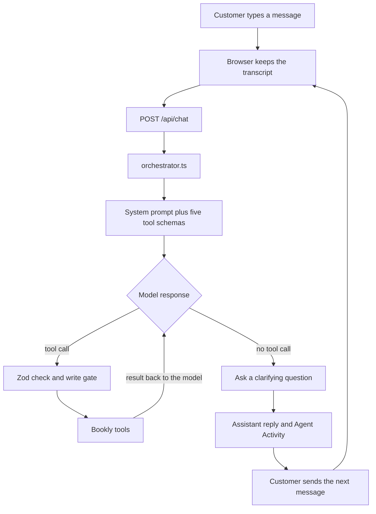

# How a request moves through Bookly

A customer message does not go straight to a tool. The browser remembers the chat, one API route starts the agent, and one loop asks the model what to do next. The model may ask a question, or it may call a Bookly tool. The tool result goes back to the model. The customer then sees a normal reply, and the next message starts the same path again.

## 1. The customer request

`ChatInterface.tsx` is the only place a person types. Send appends the new line to the messages already on screen and posts that list. The browser does not choose an intent or an order.

## 2. Chat history

That list is the memory. There is no database. A later line such as “I want to return one of the books” can reuse `BKL-1042` because the earlier status reply is still in the transcript.

Past tool JSON is not replayed on the next request. The model sees the assistant’s sentences. If it needs an item id that was never said to the customer, it calls `get_order` again inside the current request.

## 3. The API call

`POST /api/chat` in `app/api/chat/route.ts` checks that the body is a short transcript ending with a customer message, then calls `runAgent`. The response is the reply text plus a trace. The route does not call Gemini or OpenAI itself.

## 4. The prompt and the tools

`runAgent` in `lib/agent/orchestrator.ts` calls the model with three inputs:

- The system prompt in `lib/agent/system-prompt.ts`. It says to ask when an order number or a book is missing, to reuse facts already in the chat, and never to claim a return succeeded unless the tool did. It does not contain the order catalog or the 30-day rule.
- The transcript.
- Five tool schemas from `lib/agent/tool-registry.ts`: `get_order`, `search_policy`, `check_return_eligibility`, `create_return`, and `escalate_to_human`. The same registry runs the tool later.

`lib/llm/index.ts` picks Gemini when `GEMINI_API_KEY` is set, otherwise OpenAI.

## 5. The model decides

If the model returns text and no tool call, that text is the customer answer. That is the clarifying-question path: “What’s your order number?” or “Dune or Project Hail Mary?”

If the model requests a tool, the loop does not trust the arguments blindly.

## 6. Validation and the write gate

Zod parses the arguments. Read tools run immediately. `create_return` and `escalate_to_human` pass through `lib/agent/confirmation.ts` first.

The gate looks only at messages the customer has already sent. `create_return` runs when the previous assistant message asked to create the return and the latest customer message is a short yes. “Dune” is not a yes. A write requested in the same turn as a lookup is refused, and the model is told the action did not happen.

## 7. The tools

| Tool | Kind | What it uses |
| --- | --- | --- |
| `get_order` | Read | `lib/data/orders.ts` |
| `search_policy` | Read | Keyword lookup in `lib/data/policies.ts` |
| `check_return_eligibility` | Read | Delivered, inside 30 days, not already refunded, no return yet |
| `create_return` | Write | Runs the eligibility check again, then stores the return in process memory |
| `escalate_to_human` | Write | Mock handoff after the customer asks for a person, or agrees to one |

The first return id in a process is `RET-8817`. The model does not invent that id.

The loop sends the tool result back to the model and asks again. It stops when the model writes a reply, or after six model calls.

## 8. What comes back to the customer

The chat shows the model’s final sentences. The Agent Activity panel shows the tool name, the arguments, and a short result, such as “Eligible — $18.99” or “Awaiting customer confirmation.” It does not show hidden reasoning.

## 9. The customer goes again

The next send posts the old transcript plus the new line. After “Would you like me to create the return?” a “Yes” is a new request. The gate can now see both the question and the yes, so `create_return` runs, and the reply names the return id from the tool.

New chat clears the transcript and the trace. The path is the same. The memory is empty again.
